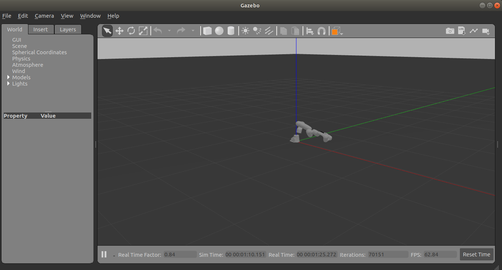
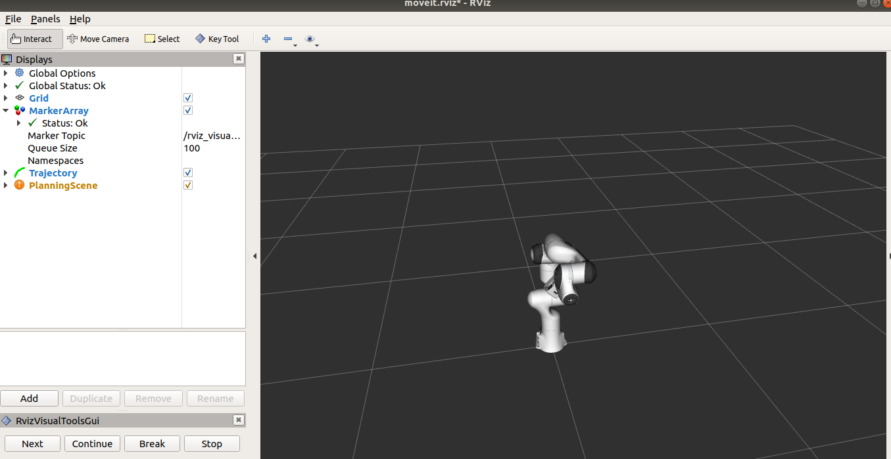

# Franka Gazebo Model
This is an attempt to build franka gazebo model with ROS Melodic on
Ubuntu 18.04. 

Basically, it all started with the [Moveit
tutorial](https://ros-planning.github.io/moveit_tutorials/doc/setup_assistant/setup_assistant_tutorial.html)
that talks about controlling the robot on Gazebo. It did not work for
me. The gazebo screen does not show the robot at all. It turns out
that the urdf file generated by moveit assistant manager does not have
all the necessary components to display this robot. 

A bit of google search led me to [this](https://erdalpekel.de/?p=55)
link which I followed to  to rebuild the `franka_ros` package cloned
from
[this](https://github.com/frankaemika/franka_ros/tree/melodic-devel)
repository.

You can also clone the repository using the following command:

```
$ git clone https://github.com/frankaemika/franka_ros -b melodic_devel
```
In order to build this package with `catkin`, you might need to
install the following packages

```
sudo apt-get install ros-melodic-franka-*
sudo apt-get install ros-melodic-gazebo-ros-control
sudo apt-get install ros-melodic-ros-control
```

After this, you can follow the instructions available on the above
link to modify the respecting xacro, launch and config files. However,
     the instruction is not complete and requires quite a bit of work
     to get them working.

Gazebo model for the franka robot is also available for ROS Kinetic at
[this](https://github.com/mkrizmancic/franka_gazebo) link.  This can
also be used to fix some of the problems that I am facing now. 

I have combined all these modifications and making it available as a
repository with the hope that people can improve on this and learn
from my experience. 

You can clone this repository into the source folder of your catkin
workspace and build it using `catkin_make` command. 

```
$ cd catkin_ws/src
$ git clone https://github.com/swagatk/franka_gazebo_melodic.git
$ cd ..
$ catkin_make
$ source devel/setup.bash
```
It should compile without any error.
Now you should execute the following command to launch Gazebo and Rviz
windows together:

```
$ roslaunch franka_description gazebo.launch
```
You will be able to see the following two screens:

* Gazebo Window


As you can see, the robot arm falls vibrates and falls down on the
  ground.
 
 * Rviz window

  The rviz screen looks OK. 

I notice the following two errors on the terminal when I execute the
above command - one is about the planner request and the other is
about action client. 

```
[ERROR] [1599737909.449017002]: Exception while loading planning adapter plugin 'default_planner_request_adapters/ResolveConstraintFrames': According to the loaded plugin descriptions the class default_planner_request_adapters/ResolveConstraintFrames with base class type planning_request_adapter::PlanningRequestAdapter does not exist. Declared types are  default_planner_request_adapters/AddIterativeSplineParameterization default_planner_request_adapters/AddTimeOptimalParameterization default_planner_request_adapters/AddTimeParameterization default_planner_request_adapters/Empty default_planner_request_adapters/FixStartStateBounds default_planner_request_adapters/FixStartStateCollision default_planner_request_adapters/FixStartStatePathConstraints default_planner_request_adapters/FixWorkspaceBounds
```
```
[ERROR] [1599737932.109590269, 17.002000000]: Action client not connected: panda_arm_controller/follow_joint_trajectory
```

I am leaving this here at the moment. I will try to come back after I
try the whole thing out with the UR robot model which is hopefully
more well documented. In the mean time, please use this information to
improve on this.


